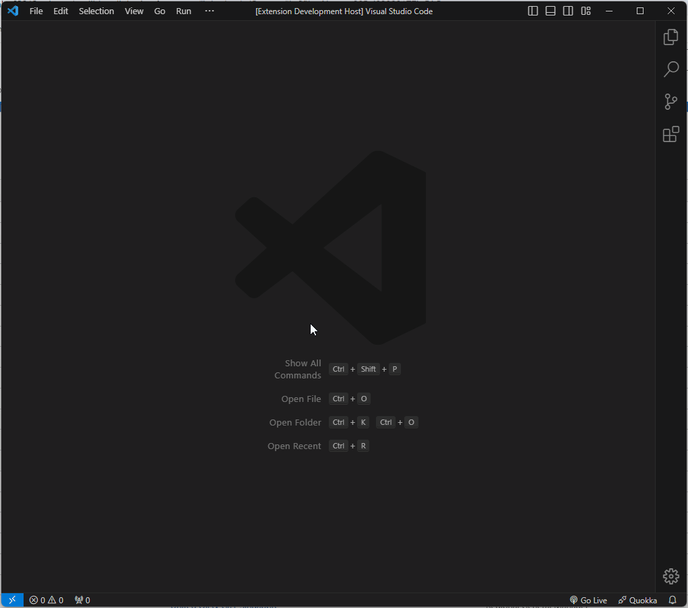
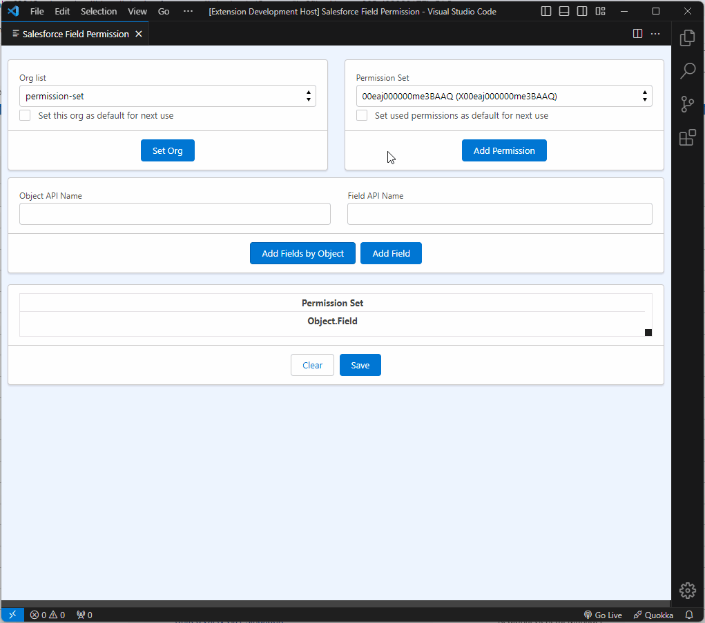
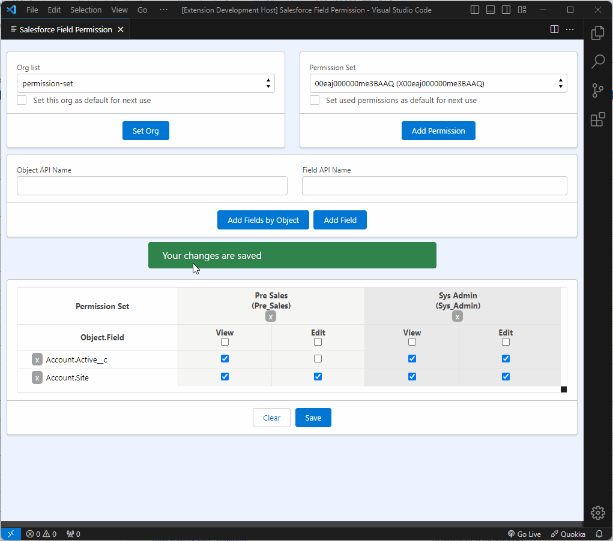

# Salesforce Field Permission

Mass update field permissions for different objects in field sets.

## Overview

If you spent a lot of time setting field permission in permission sets, this extension is for you!

This extension uses [Salesforce CLI](https://github.com/forcedotcom/salesforcedx-vscode) and [JSforce](https://github.com/jsforce/jsforce) to mass update field permissions for different objects in field sets directly in your VS Code using authenticated orgs from salesforce cli.

You can set org and permission sets as default and when you open the page these settings are pre-filled and you can use less clicks (and time :wink:).

## Requirements

 - VS Code
 - Authenticated orgs from Salesforce CLI

## Features

- [x] List all authenticated orgs from salesforce cli
- [x] Select permission set from a list
- [x] Add Object API and Field API as text fields
- [x] Select fields from a object
- [x] Create/Update permission set fields
- [x] Set org as default for next use
- [x] Set permission set as default for next use

## Basic usage

## Selecting fields from an object

## Setting org and permission sets as default

## Release Notes

You can view all changes from [CHANGELOG](./CHANGELOG.md) file

## Author

- Jonathan Valoto - [GitHub](https://github.com/jvaloto)